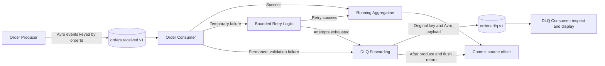

# Resilient Kafka Order Processing Pipeline

A Kafka-based event-driven order processing system demonstrating reliable message processing, Avro serialization, real-time aggregation, retry handling, Dead Letter Queue processing, and explicit offset management.

## Overview

Orders are produced as Avro events and transported through Apache Kafka to a Python consumer. Successfully processed orders contribute to a running count, total price, and average price. Temporary processing failures are retried; permanent validation failures and exhausted retries route the original event to a Dead Letter Queue (DLQ).

The order consumer explicitly commits offsets after updating the aggregation or completing its DLQ forwarding routine. A separate consumer reads and displays failed orders for inspection. This is a hands-on engineering project exploring resilience in a small event-driven data processing system, with implementation boundaries described below.

## What This Project Demonstrates

Consuming a message is only one part of an event-driven system. A consumer also needs to decide what constitutes success, which failures can recover, where failed events go, and when processing progress should be recorded.

- **Structured serialization:** a shared Avro schema defines the order payload.
- **Asynchronous communication:** a producer publishes keyed events independently of consumers.
- **Consumer processing:** business validation separates acceptable orders from permanent failures.
- **Failure handling and retry strategies:** temporary errors receive bounded attempts with a fixed delay.
- **Dead Letter Queues:** failed records are forwarded to a separate topic for inspection.
- **Offset management:** the main consumer uses synchronous, explicit commits after processing decisions.
- **Real-time aggregation:** each successful order updates an in-memory count, total, and running average.

## Architecture



Retries run inside the order consumer; there is no separate retry topic or worker. The source offset commit does not wait for the DLQ consumer to read the record. DLQ publication and source offset commits are separate operations, not an atomic transaction.

## Components and Event Contract

| Component | Responsibility |
| --- | --- |
| [`producer.py`](producer.py) | Publishes ten sample orders, keyed by order ID, with delivery callbacks. |
| [`consumer.py`](consumer.py) | Deserializes, validates, retries, aggregates, forwards failures, and commits source offsets. |
| [`dlq_consumer.py`](dlq_consumer.py) | Deserializes and prints failed orders with Kafka partition and offset metadata. |
| [`schemas/order.avsc`](schemas/order.avsc) | Defines the shared Avro `Order` record. |
| [`utils/`](utils/) | Provides Avro serialization, YAML configuration loading, and business validation. |
| [`exceptions.py`](exceptions.py) | Distinguishes temporary and permanent processing errors. |
| [`config/config.yaml`](config/config.yaml) | Holds topic names, consumer groups, broker address, and retry settings. |
| [`docker-compose.yml`](docker-compose.yml) | Starts Kafka and initializes both topics after the broker is healthy. |

| Field | Avro type | Business rule |
| --- | --- | --- |
| `orderId` | `string` | Must not be empty; also used as the UTF-8 Kafka key. |
| `product` | `string` | Must not be empty. |
| `price` | `float` | Must be greater than zero. |

Example payload before serialization:

```json
{"orderId": "1001", "product": "Laptop", "price": 899.99}
```

The applications use `fastavro` schemaless binary encoding with a local schema file. There is no Schema Registry. DLQ records preserve the original key and Avro value; they do not include an error envelope or retry metadata.

## Processing and Failure Behavior

The consumer validates each decoded order before applying the temporary failure simulation. Permanent validation errors bypass retries. Temporary errors are retried with a fixed two-second delay between attempts.

Although the configuration key is named `max_retries`, the loop treats its default value of `3` as **three total attempts**, including the first attempt.

For one producer run against empty topics with a newly started order consumer:

| Orders | Behavior | Result |
| --- | --- | --- |
| `1001`, `1002`, `1005`–`1010` | Valid orders with no simulated failure. | Eight orders contribute to the aggregation. |
| `1003` | Configured to fail temporarily five times; only three attempts are available. | Forwarded to the DLQ after retry exhaustion. |
| `1004` | Produced with a price of `-50.0`. | Forwarded directly to the DLQ after validation. |

Products and valid prices are randomized, so totals vary. The consumer prints the processed count, total price, running average, partition, offset, and commit messages. The DLQ consumer should display orders `1003` and `1004` under these conditions.

To explore retry recovery, change `temporary_failures_remaining["1003"]` in `consumer.py` from `5` to `2` before starting the consumer: the third attempt will succeed. The failure counter lives in memory and resets on consumer restart. Repeated producer runs reuse order IDs, and the consumer does not deduplicate them, so later runs in the same consumer process can behave differently.

## Run Locally

Requirements: Python 3.12 or newer, `uv`, and Docker with Docker Compose. Run all commands from the repository root so relative configuration and schema paths resolve correctly.

### 1. Install dependencies

```sh
uv sync --locked
```

The Python dependencies are `confluent-kafka`, `fastavro`, and `PyYAML`. The resolved environment is recorded in `uv.lock`; `requirements.txt` also provides pinned dependencies for pip-based environments.

### 2. Start Kafka and initialize topics

```sh
docker compose up -d
docker compose ps -a
docker compose logs kafka-init
```

Compose starts Apache Kafka 4.0.0 as a single broker/controller in KRaft mode, without ZooKeeper. The `kafka-init` service waits for broker health, then creates `orders.received.v1` and `orders.dlq.v1`, each with one partition and replication factor one. The initialization container is expected to exit after finishing.

Verify both topics exist before running the applications:

```sh
docker compose exec kafka /opt/kafka/bin/kafka-topics.sh --bootstrap-server localhost:9092 --list
```

### 3. Start the consumers in separate terminals

Order processor:

```sh
uv run --locked consumer.py
```

DLQ monitor:

```sh
uv run --locked dlq_consumer.py
```

### 4. Publish sample orders

In a third terminal:

```sh
uv run --locked producer.py
```

The producer sends ten orders approximately one second apart, then flushes pending deliveries and exits. Compare the consumer output with the failure behavior table above. Both consumers keep polling until interrupted with `Ctrl+C`.

### 5. Stop the environment

```sh
docker compose down
```

Compose does not configure a persistent Kafka data volume. Treat this as a disposable local environment; do not rely on topic data surviving container removal.

## Configuration and Offset Management

| Setting | Default | Usage |
| --- | --- | --- |
| Broker | `localhost:9092` | Host access for Python applications; Compose initialization uses `kafka:29092`. |
| Orders topic | `orders.received.v1` | Producer output and order consumer input. |
| DLQ topic | `orders.dlq.v1` | Failed order output and DLQ monitor input. |
| Order consumer group | `order-aggregation-group` | Tracks source processing progress. |
| DLQ consumer group | `dlq-monitor-group` | Tracks inspection progress independently. |
| `retry.max_retries` | `3` | Total processing attempts per order. |
| `retry.delay_seconds` | `2` | Fixed delay between temporary failure attempts. |

Configuration is partially centralized: the DLQ producer and DLQ consumer still hard-code `localhost:9092`, the DLQ consumer hard-codes its group, and all three scripts use `schemas/order.avsc` directly. Changing the corresponding YAML values alone will not update those paths. Topic changes also require updating Compose initialization.

The order consumer disables automatic commits and calls `commit(message=message, asynchronous=False)` after either successful aggregation or DLQ forwarding. The DLQ monitor uses the client's default automatic commit behavior.

Both consumers set `auto.offset.reset` to `earliest`. This applies when there is no valid committed offset; restarting an existing group normally resumes from its committed progress rather than replaying all records. Aggregation state starts from zero on every process start, independently of the group's stored offsets.

## Design Boundaries

- **Delivery guarantees:** DLQ forwarding calls `produce()` and `flush()`, but does not check delivery callbacks or the flush result. Successful DLQ delivery is not verified before committing the source offset. There are no Kafka transactions or exactly-once guarantees, and reprocessing can produce duplicates.
- **Aggregation scope:** count, total, and average are held only in the consumer process. They are not persisted, shared across consumers, or calculated in time windows. Avro `float` prices also have binary floating-point precision limits.
- **Failure coverage:** retries cover the explicitly raised temporary processing error; permanent business validation errors go directly to the DLQ. Malformed Avro payloads and unexpected exceptions are not covered by this routing and can stop the consumer.
- **Retry throughput:** sleeping between attempts blocks the consumer loop. This keeps the flow easy to inspect but delays subsequent records during failures.
- **DLQ operations:** the monitor displays failed records; automated replay, remediation, and enriched failure metadata are not implemented.
- **Deployment scope:** a single local broker, plaintext listeners, and console output support a hands-on demonstration. High availability, authentication, durable application state, and operational monitoring would require further work before production use.
